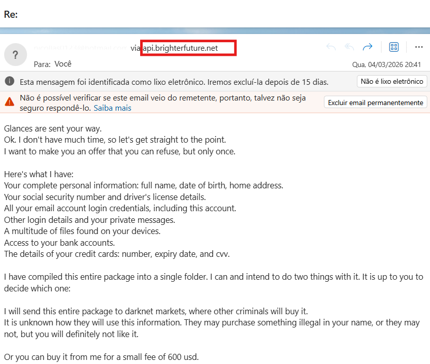

# 🔍 Análise de Campanha Sextortion — OSINT & Threat Intelligence

> **Projeto de estudo prático em análise de e-mail malicioso, OSINT e rastreamento de infraestrutura criminosa**  
> Analista: Nicollas Cavalcante Souza  
> Data do incidente: 04/03/2026  
> Status da infraestrutura: **Ativa em 19/03/2026**

---

## 🎯 Objetivo

Este projeto documenta uma investigação OSINT conduzida a partir de um e-mail de sextortion recebido, partindo dos headers do e-mail até o rastreamento da infraestrutura de servidores e do fluxo de lavagem de dinheiro em Bitcoin.

O objetivo não foi apenas identificar o golpe, foi entender como a infraestrutura funciona, como o dinheiro se move e até onde é possível rastrear usando apenas ferramentas públicas de OSINT e threat intelligence.

**Spoiler:** fui atrás achando que seria um scam aleatório sem muita operação e acabei encontrando indicativos de uma possível estrutura utilizada para lavagem de valores vindos de scams ou outras atividades maliciosas

---

## 📖 O Golpe — Sextortion Scam

O e-mail recebido seguia o padrão clássico de **sextortion em massa**:



- Alega ter acesso a dados pessoais, senhas, arquivos e câmera do dispositivo
- Exige pagamento de **USD 600 em Bitcoin** em até 1 dia
- Usa linguagem de urgência e intimidação para pressionar a vítima
- **Nenhuma das informações alegadas é real**. É engenharia social pura (famoso, é verdade esse bilhete)

O primeiro passo foi não pagar. O segundo foi investigar.

---

## 🛠️ Ferramentas Utilizadas

| Ferramenta | Uso |
|---|---|
| **VirusTotal** | Reputação de IP, Passive DNS, Relations |
| **AbuseIPDB** | Histórico de abuse reports |
| **Shodan** | Portas abertas e serviços expostos no servidor |
| **URLScan.io** | Análise de comportamento HTTP do domínio |
| **Blockchain.com** | Rastreamento de transações Bitcoin |

---

## 🔎 Investigação

### 1. Ponto de partida — Headers do E-mail

Tudo começou analisando o cabeçalho do e-mail no Outlook (`Exibir origem da mensagem`). Os headers revelaram imediatamente que o e-mail era fraudulento:

```
Authentication-Results: spf=none (sender IP is 164.92.68.246)
smtp.mailfrom=api.brighterfuture.net
dkim=none (message not signed)
dmarc=fail action=none header.from=hotmail.com
compauth=fail reason=001

Return-Path: microllion@api.brighterfuture.net
X-Sender-IP: 164.92.68.246
X-MS-Exchange-Organization-SCL: 5
dest:J;OFR:SpamFilterAuthJ
```

O que cada campo e tag revelou:
- **SPF none** : domínio sem política SPF definida → ausência de validação de origem (comum em abusos)
- **DKIM none** : e-mail sem assinatura digital → não autenticado
- **DMARC fail** : falha de autenticação (SPF/DKIM) → possível spoofing ou envio não autorizado
- **Return-Path** : diferente do `From:` → endereço real do atacante exposto: `microllion@api.brighterfuture.net`
- **SCL:5 / dest:J** : Microsoft classificou como suspeito e entregou na pasta Junk

O `From:` estava spoofado como o próprio endereço da vítima, técnica para aumentar o senso de urgência.

---

### 2. Investigando o IP — 164.92.68.246

**VirusTotal**

Ao identificar o IP no header, fiz a coisa mais sensata: procurar em base pública.


- 1/94 vendors flagged — IP rotacionado para evasão de blacklists, por isso poucas flags (já me soou algo mais bem feito do que imaginava)
- Passive DNS (aba Relations no VirusTotal) revelou todos os domínios associados ao IP — vamos usar isso em breve

**AbuseIPDB**

Aproveitando o embalo, fui analisar se há reports de abuso sobre o IP:


- 2 reports de 2 fontes distintas
- Primeiro report: **27/02/2026**, apenas 5 dias antes do e-mail recebido
- Categorias: Web Spam, Email Spam, Spoofing, Exploited Host, Phishing, Hacking, Bad Web Bot
- IP **ainda ativo em 19/03/2026**

**Shodan**

O Shodan serviu para entendermos o que pode ter sido a possível killchain do atacante e quais portas permitiriam isso:


| Porta | Serviço | Observação |
|---|---|---|
| 22 | SSH — OpenSSH 8.9p1 Ubuntu | Acesso remoto ativo ao server |
| 80 | HTTP | Servidor web ativo |
| 443 | HTTPS | Erro TLS — mal configurado ou server abandonado |
| **3306** | **MySQL 8.0.42** | **⚠️ Banco de dados exposto publicamente** |

A porta 3306 exposta é crítica, banco de dados sem firewall, é uma má configuração ou uso deliberado que indica comprometimento, sendo necessário validação adicional.

**Hipótese de cadeia de ataque (baseada nos dados observados)**

```
Aluga/Compromete VPS DigitalOcean
              ↓
Instala servidor SMTP (brighterfuture.net)
              ↓
Dispara spam em massa com SPF none
              ↓
Vítima recebe → paga Bitcoin
              ↓
Mixing em camadas → Exchange → saque
```

---

### 3. Investigando os Domínios

Com uma boa quantidade de informação levantada, o próximo passo foi analisar os domínios vinculados ao IP que coletamos via VirusTotal Relations.

**`brighterfuture.net`** — domínio do servidor SMTP


- Registrado: 08/09/2022 via GoDaddy
- Status: 'clientDeleteProhibited', 'clientTransferProhibited'— mecanismo padrão de proteção de domínio (Registrar Lock)
- URLScan retornou **HTTP 502** — servidor abandonado
- Expira: 08/09/2026

**`licftluimc.quest`** — domínio identificado no certificado TLS do servidor

- Nome com padrão aleatório, possivelmente gerado por algoritmo (DGA)
- Certificado Let's Encrypt **expirado em 04/05/2023**
- Não encontrado no URLScan — domínio inativo ou nunca acessível publicamente
- Associado ao mesmo IP desde fev/2023 via VirusTotal Relations

---

### 4. Rastreamento Bitcoin

Com os dados de IP e domínios levantados, fiquei curioso sobre a carteira Bitcoin e como funciona o processo de recebimento. A carteira exposta no e-mail era apenas a entrada de uma cadeia de lavagem em múltiplas camadas.

**Carteira coletora — 14id3vCsWLocRamkLqfb3J9jhpxTHPz59m**


- Total recebido: **0.02139044 BTC ≈ R$ 7.500**
- 2 transações — vítimas confirmadas que pagaram
- Esvaziada em **16/06/2024**

---

### 5. Fluxo de Lavagem — Peel Chain


A saída da carteira coletora consolidou **20 carteiras diferentes** em uma única transação, padrão clássico de mixing para dificultar rastreamento.


Após a consolidação, o dinheiro passou por múltiplas camadas usando a técnica de **peel chain**: o atacante divide o valor em pequenas transações e frequentemente envia para si mesmo para poluir os logs e dificultar análise.

O rastreamento direto chegou até aqui:

```
[Vítimas pagam]
14id3vCsWLocRamkLqfb3J9jhpxTHPz59m
R$ 7.500 — 2 transações
        |
        | 16/06/2024 — Consolidação com 19 outras carteiras
        ↓
1Gi5sqSA6NKfkaPdMu4szv1bzt3XxCyryU
R$ 84.000 consolidados (20 inputs)
        |
        | 30/06/2024 — Split em múltiplas saídas
        ↓
bc1qywz7lnh2w78...  →  bc1q3axh7dtnsq3... (peel chain — fragmenta e polui log)
1CWTFeMfPCG1Q6u...  →  bc1qqaae3hvu4l4... → 36yHeaDuLXoTnez...
        |
        | 
        ↓
bc1q9wvygkq7h9xgcp59mc6ghzczrqlgrj9k3ey9tz
        |
        | Migração para SegWit (Bech32 P2WPKH)
        ↓
bc1qvh6rmy6j55t9gr6u29eg4qkmtwswj9r9waawyx
        |
        | Cascata de peel chain contínua:
        | bc1q-awyx → bc1q-msgu → bc1p-w8yn / bc1p-eu5a → ...
        ↓
[Rastro se dilui em cascata ad infinitum]
[Destino final não rastreado diretamente via ferramentas públicas]
```

> 💡 **Para verificar as carteiras diretamente:**
> - Coletora: [14id3vCsWLocRamkLqfb3J9jhpxTHPz59m](https://www.blockchain.com/explorer/addresses/btc/14id3vCsWLocRamkLqfb3J9jhpxTHPz59m)
> - Consolidadora: [1Gi5sqSA6NKfkaPdMu4szv1bzt3XxCyryU](https://www.blockchain.com/explorer/addresses/btc/1Gi5sqSA6NKfkaPdMu4szv1bzt3XxCyryU)
> - SegWit intermediário: [bc1qvh6rmy6j55t9gr6u29eg4qkmtwswj9r9waawyx](https://www.blockchain.com/explorer/addresses/btc/bc1qvh6rmy6j55t9gr6u29eg4qkmtwswj9r9waawyx)

---

### 6. A Exchange — bc1q-pemf

Durante a análise de relações da carteira consolidadora, identifiquei de forma independente uma carteira com comportamento atípico de alto volume:


A carteira `bc1q7cyrfmck2ffu...` (bc1q-pemf) apresenta:

- **2.839.530 transações**
- **Volume total movimentado: ~$2 BILHÕES**
- Comportamento de receber e repassar quase tudo — Total recebido ($2.051.674.553.941) / Total enviado ($2.051.628.361.952), com volume total sendo praticamente o dobro

> ⚠️ **Importante:** esta carteira **não foi rastreada diretamente**. Como destino final da nossa cadeia o fluxo da `bc1q-awyx` continua em cascata ad infinitum via múltiplas camadas de peel chain e não foi possível provar a ligação direta via ferramentas públicas. A `bc1q-pemf` foi identificada de forma independente pela análise de relações e seu comportamento é **consistente com o destino final esperado** de uma operação dessa escala — exchange centralizada ou mixer profissional onde o rastro público se encerra.

É importante ressaltar que esta carteira **não recebe exclusivamente da nossa cadeia**. Ela movimenta fundos de milhares de origens simultaneamente. Nossa cadeia de lavagem, se chegou até ela, seria apenas uma das milhares de entradas, diluindo completamente a origem dos fundos no pool geral.

**O que é SegWit e por que o atacante migrou para ele?**

SegWit (Segregated Witness) é um formato moderno de endereço Bitcoin identificado pelo prefixo `bc1q`. A migração progressiva de Legacy (`1xxx`) para SegWit ao longo das camadas não é coincidência:

- **Taxas menores** — essencial ao mover dezenas de carteiras simultaneamente
- **Menor rastreabilidade** — em ferramentas antigas de blockchain analytics é mais difícil rastrear
- **Padrão de exchanges profissionais** — facilita entrada sem levantar flags de suspeita

---

## 📊 Linha do Tempo

```
Set/2022    → brighterfuture.net registrado no GoDaddy
Fev/2023    → IP alocado na DigitalOcean
              Cert licftluimc.quest emitido via Let's Encrypt
Mai/2023    → Certificado licftluimc.quest expira
16/06/2024  → 20 carteiras consolidadas → R$ 84.000 movidos
30/06/2024  → Split em múltiplas saídas — peel chain iniciado
21/08/2024  → 80 inputs consolidados → R$ 560.000
Nov/2024    → Último DNS resolution de api.brighterfuture.net
27/02/2026  → Primeiro abuse report no AbuseIPDB
04/03/2026  → E-mail de sextortion recebido
15/03/2026  → Segundo abuse report no AbuseIPDB
19/03/2026  → Investigação conduzida — IP ainda ativo
              Reportado ao FBI IC3 e DigitalOcean Abuse
              AbuseIPDB report pendente aprovação de conta
```

---

## 🧠 Conclusão

O que parecia um golpe simples revelou indícios de uma operação estruturada:

- **Infraestrutura ativa por 3+ anos** — associada ao mesmo IP sem evidência de takedown
- **Peel chain** — técnica utilizada para fragmentar valores e dificultar rastreamento no blockchain
- **Migração progressiva** — Legacy → SegWit ao longo das camadas de transação
- **MySQL exposto na porta 3306** — possível má configuração ou exposição indevida, exigindo validação adicional
- **Indícios de operação em larga escala** — com múltiplas carteiras e movimentações financeiras relevantes
- **Rastro público limitado** — diluído em múltiplas camadas de peel chain, dificultando correlação direta via ferramentas públicas

A investigação chegou até onde as ferramentas públicas permitem. O próximo passo exigiria ferramentas de blockchain forensics profissionais (Chainalysis, CipherTrace) ou dados KYC de exchange via ordem judicial.

---

## 📣 Como Reportar

Se você recebeu um e-mail similar:

| Canal | Link | O que reportar |
|---|---|---|
| **AbuseIPDB** | https://www.abuseipdb.com | IP do remetente |
| **FBI IC3** | https://www.ic3.gov | Crime completo com evidências |
| **DigitalOcean Abuse** | abuse@digitalocean.com | IP e MySQL exposto |
| **GoDaddy Abuse** | https://supportcenter.godaddy.com/AbuseReport | Domínio brighterfuture.net |

---

## 🛡️ Recomendações

**Para usuários:**
- **Nunca pagar** — as informações são falsas! É Cilada Bino!
- Ativar **MFA** em todas as contas críticas
- Usar **senhas únicas** por serviço via gerenciador de senhas

**Para analistas / blue team:**
- Bloquear IP `164.92.68.246` e range `164.92.64.0/18`
- Blacklist de DNS: `brighterfuture.net`, `licftluimc.quest`
- Criar regra no SIEM: e-mails com SPF none + DMARC fail originados de ASN de datacenter (AS14061) | Regra Sigma disponível em [DETECTIONS.md](DETECTIONS.md), conversível para qualquer SIEM via [Uncoder.IO](https://tdm.socprime.com/uncoder-ai/translate)
- Adicionar carteiras Bitcoin identificadas em feeds de threat intelligence

---

## 📁 Estrutura do Repositório

```
sextortion-analysis/
├── README.md
├── iocs.txt
├── email_redacted.eml
└── evidence/
    ├── 00_email_recebido.png
    ├── 01_virustotal_ip.png
    ├── 02_abuseipdb.png
    ├── 03_shodan_ports.png
    ├── 04_urlscan_brighterfuture.png
    ├── 05_blockchain_coletora.png
    ├── 06_blockchain_consolidadora.png
    ├── 07_blockchain_segwit.png
    ├── 08_blockchain_pemf_summary.png
    ├── 09_blockchain_pemf_saida.png
    └── 10_blockchain_mixing_flow.png
```

---

## ⚠️ Disclaimer

Esta análise foi conduzida exclusivamente com ferramentas públicas de OSINT e threat intelligence para fins educacionais. Nenhum sistema foi acessado ou explorado. O objetivo é documentar TTPs de campanhas de sextortion e contribuir com a comunidade de segurança da informação.
